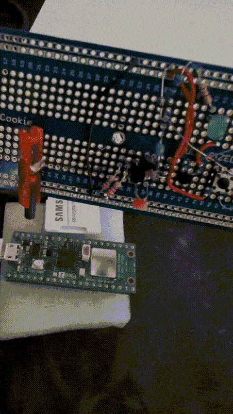
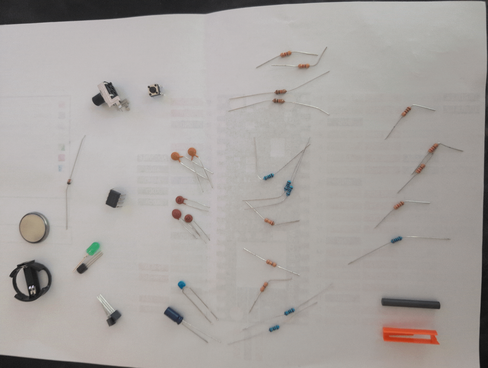
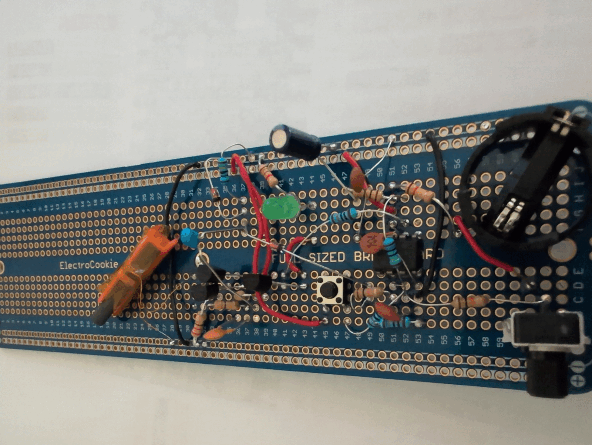
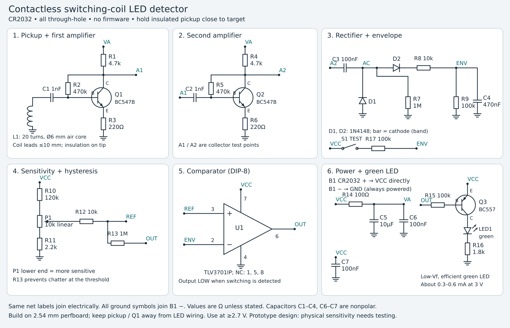

# Contactless switching-coil LED detector

## GIF and Pictures

Some resistors and a cap are soldered on the other side. The orange thing is the self-built coil with a ferrite rod in it.

Vibe-code schematic above, I think Sol 6.1 actually installed ngspice and verified this circuit before having me build it.

## Overview

This is a **fully analog circuit**, powered by a CR2032 coincell (the holder I use is [this one](https://www.mouser.de/de/ProductDetail/Adam-Tech/BH-123A-1?qs=HoCaDK9Nz5c2rBVIoNvfgQ%3D%3D)), with a small self-wound pickup coil as 'sensor'. When you are done building, hold the tip very close to the target coil and find a good pot setting until the green LED comes on ('calibration'). If you hold it near a coil and it does not turn on it means the coil is not switching. Basically the underlying concept is switching coil -> changing magnetic field -> induces voltage in our sensor coil -> small current can flow -> we amplify current x100 via two transistors, we use two diodes for rectifiying the signal, we use a comparator to decide LED on/off (basically analog to digital step, LED switching performed via a PNP transistor) and use smoothing caps so that the LED is solid on or solid off (not flickering all the time). We also have a calibration pot that affects sensitivity towards certain switching frequencies. We also have a 'is-my-battery-even-working' push button that always turns on LED while it is being pressed. Important note: While a battery is inserted this device is **on** and draining the battery at a rate of around **17 mAh per day** when idling, you should replace the battery when it falls below 2.7v under load.

## Why build this device?

If you do laptop repairs (I don't xD) it sometimes is useful to diagnosing to see whether a given coil is switching or not. I saw sorin use a device like this (made by [alexof](https://alexsof.com/product/inductor-motherboard-tester-detect-inductance-coil-activity/) more professionally than mine) to diagnose laptops and thought it is a cool device.

## Making the coil

I broke apart a plastic pen for the plastic tube (or a similarly shaped plastic thingy), then wrapped around 20 turns of 0.15mm enameled copper wire. Then I inserted a [Fair-Rite 3078990881](https://www.mouser.de/ProductDetail/Fair-Rite/3078990881?qs=aTFcLA2DbqtzZKNGUfytkw%3D%3D) ferrite rod into the palstic tube (which the wire is wrapped around), it is a fairly small rod (4mm diameter and 30mm long, really nothing to brag about ;).

## Parts

All parts are through-hole parts for easy (painful) hand soldering on a protoboard.

| Reference | Value / part | Quantity |
|---|---|---:|
| B1 | CR2032 and battery holder | 1 |
| S1 | Pushbutton | 1 |
| U1 | TLV3701IP | 1 |
| Q1, Q2 | BC547B | 2 |
| Q3 | BC557 PNP | 1 |
| D1, D2 | 1N4148 | 2 |
| LED1 | Green LED | 1 |
| L1 | Hand-wound pickup, described at the end | 1 |
| R7, R13 | 1 MΩ | 2 |
| R2, R5 | 470 kΩ | 2 |
| R10 | 120 kΩ | 1 |
| R9, R15 | 100 kΩ | 2 |
| R17 | 100 kΩ | 1 |
| R8, R12 | 10 kΩ | 2 |
| R1, R4 | 4.7 kΩ | 2 |
| R11 | 2 kΩ (or 2.2kΩ depending on what u have) | 1 |
| R16 | 1.8 kΩ | 1 |
| R3, R6 | 220 Ω | 2 |
| R14 | 100 Ω | 1 |
| P1 | 10 kΩ **linear** potentiometer | 1 |
| C5 | 10 µF | 1 |
| C4 | 470 nF (or 220 nF if u don't have that, just affects how soon the LED will turn off again) | 1 |
| C3, C6, C7 | 100 nF | 3 |
| C1, C2 | 1 nF | 2 |

## My wiring instructions (incremental build with multimeter checks every now and then [briefly insert battery for tests, remove it otherwise])

1. Solder the battery holder and connect it to `+` and `-` rail of the breadboard
2. Solder the TLV regulator and connect its pin 4 to `-` rail, then connect pin 7 to `+` rail
3. Solder a 100 nF cap between the TLV pins 4 and 7

---

4. Solder Pot
5. 10k ohm res between TLV pin 3 and pot wiper (pot middle pin 2)
6. 120k ohm res between TLV pin 7 and pot outer pin 1
7. 2k ohm res between TLV pin 4 and other pot outer pin 3

* Multimeter tests (put ground as TLV pin 4)
    * pin 7 has around 3.3 v
    * pin 6 has around 3.3 v
    * pin 2 has 0 v
    * pin 3 voltage depends on pot setting. in one extreme pot setting i get 0.087 v and in the other extreme pot setting i get 0.344 v

---

8. Solder BC557, its pinout is pin 1 = collector, pin 2 = base, pin 3 = emitter)
9. Wire between BC557 pin 1 to LED anode
10. 100k ohm res between BC557 pin 2 and TLV pin 6
11. Wire between BC557 pin 3 and `+` rail of breadboard
12. 1.8k ohm res between LED cathode and `-` rail
13. Solder pushbutton (mine has 4 legs, i will describe it as 2 rows that are internally short, while u press the rows are connected)
14. Wire between one pushbutton row (row 1) and `+` rail
15. 100k ohm res between TLV pin 2 and the other pushbutton row (row 2)

* Test: While you hold the button, the LED is on

---

16. 100 ohm res between TLV pin 7 and a new row 'VA' on breadboard
17. 10 microF cap between VA and `-` rail
18. 100 nF cap between VA and `-` rail

---

19. Solder transistor BC547 (we call it `Q1`)
20. 220 ohm res between Q1 emitter and `-` rail
21. 4.7k ohm res between VA row and Q1 collector
22. 470k ohm res between Q1 collector and Q1 base

* Test: Measure between `-` rail and the following pins: VA row=3.088V, Q1 Collector=1.247V, Q1 Base=0.688V, Q1 Emitter=0.086V. And LED still lights up when button pressed

---

20. Solder transistor BC547 (we call it `Q2`)
21. 220 ohm res between Q2 emitter and `-` rail
22. 4.7k ohm res between VA row and Q2 collector
23. 470k ohm res between Q2 collector and Q2 base
24. 1 nF cap betwen Q2 base and Q1 collector

* Test: Measure between `-` rail and the following pins: VA row=3.004V, Q2 Collector=1.217V, Q2 Base=0.681V, Q2 Emitter=0.083V, Q1 collector=1.22v. And LED still lights up when button pressed

---

25. 100 nF cap between Q2 collector and new row we call `AC`
26. 1 mega ohm res between AC and `-` rail
27. diode between AC and `-` rail (black stripe/banded side at AC)
28. diode between ac and a new row call `ZZ` (banded side at ZZ)
29. 10k ohm res between ZZ and TLV pin 2

* Test: Measure between `-` rail and the following pins: Q2 collector=1.232v, AC row=0v, TLV pin 2=0v, when pressing button LED turns on, while holding button voltage at TLV pin 2 becomes around 1.45v

---

30. 1 nF cap between one inductor end and Q1 base
31. Other end of inductor connected to `-` rail, try to keep inductor leads short

* Test: Q1 pin 1 should have around 1.223v, TLV pin 2 should have 0v while you are not near any switching coil. If u move the device near a switching coil the LED turns on (of when u manually press the battery-tester push button). You can adjust the sensitivity via the pot, halfway or more and it works when holding near e.g. a switching pico 2 w coil. I inserted a ferrite rod into the coil, as shown in the images.

