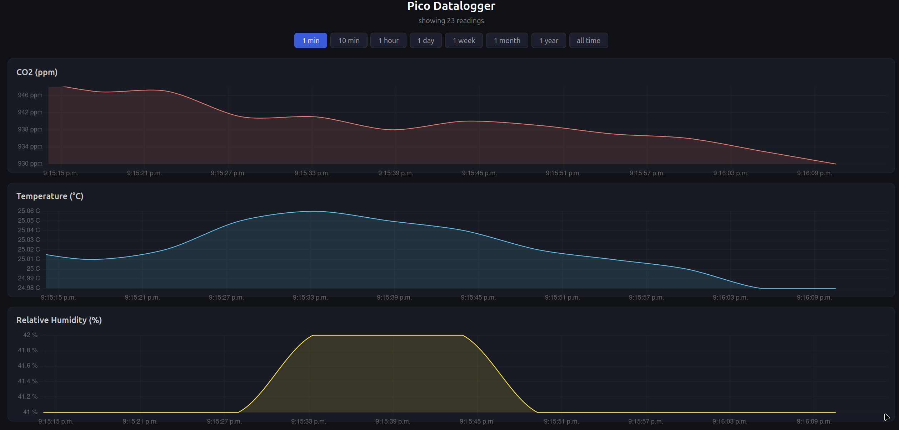

## Datalogger Project

It combines three different sensors:
* CO2 (Adafruit SCD41)
* Temp (Adafruit TMP117)
* Humidity (DHT 11)

with a Raspberry Pi Pico 2 W which broadcasts measurements every 5 seconds to a local server.
The data is stored in an sqlite db.
The project also contains the server-side code for locally hosting a website with visualizations of measurements:

