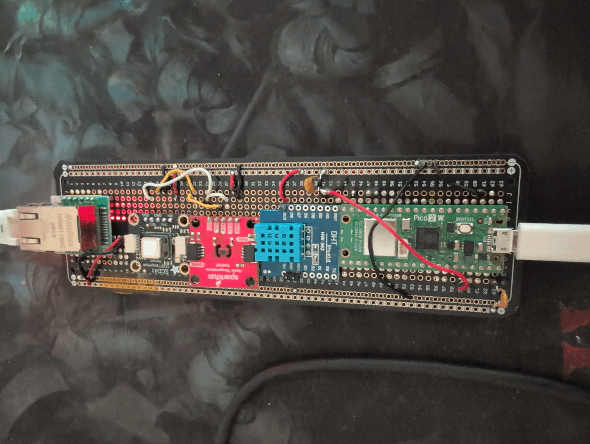
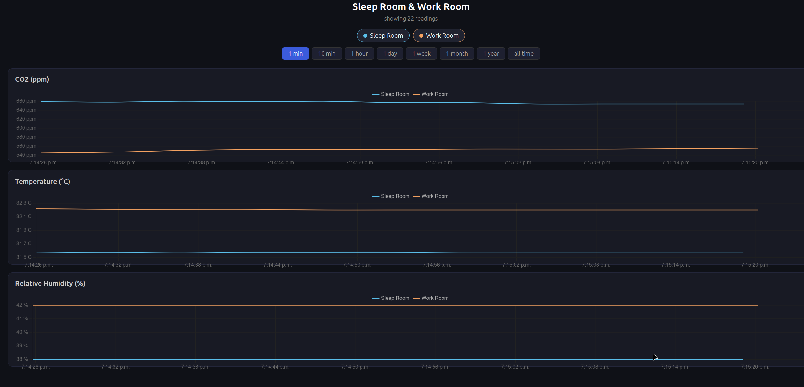

# Air Quality Nonitor v2

## Changes

* Server / website now shows up to two devices (e.g. dataloggers in different rooms), u can toggle any device on/off on the website to make its graph disappear
* Build instructions for a version of the datalogger client that uses ethernet instead of wifi (and some different sensor versions)

## MicroPython requirement

Due to us now using Ethernet, we have to compile micropython from scratch specifically with support for w5500.
I wrote a [tutorial](https://github.com/felix314159/electronics/tree/main/other/pico2w_ethernet_spi) on how to compile it with W5500 and test
whether you soldered the Ethernet SPI module correctly. The new `w5500.py` module uses MicroPython's 
native `network.WIZNET5K` driver btw so normal `socket`, DHCP, DNS and TCP behavior continue to work.

## Pictures

Some of the wires and the LDO are soldered on the other side. I cut the LED traces on the SCD41 and the TMP117 so that those lights are turned off.

---

Imagine 32 degrees celsius, I really need to get an AC unit.

## Build Instructions

### Important rules

* All parts must share the same ground.
* The sensor 3.3 V rail and the Ethernet buck converter's 3.3 V output are
  separate supplies. Do not connect those two 3.3 V outputs together.
* The W5500 must be powered from 3.3 V, never directly from 5 V/VBUS.
* Use the labels printed on each breakout, not its physical orientation, when
  identifying pins.

### Pico 2 W and sensor power rail

* Pico physical pin 36 (`3V3 OUT`) -> MF-R025 resettable fuse -> sensor 3.3 V
  breadboard rail.
* Pico physical pin 38 (`GND`) -> common breadboard ground rail.
* Pico physical pin 29 (`GPIO22`) -> DHT11 data row.
* Pico physical pin 21 (`GPIO16`, I2C0 SDA) -> shared I2C SDA row.
* Pico physical pin 22 (`GPIO17`, I2C0 SCL) -> shared I2C SCL row.

The Pico 2 W documentation recommends keeping external load on `3V3 OUT`
below 300 mA. That's why all sensors remain on this 3.3 Vrail, while the W5500 uses its own
5V pico rail with a buck converter down to 3.3V so that not everything is powered from the same pico rail.

### Main power

The project is powered through the Pico's micro-USB connector with the
official Raspberry Pi 12.5 W supply. Pico physical pin 40 (`VBUS`) exposes the
USB input voltage and supplies the Ethernet buck converter described below.

`VBUS` is only present when USB is powered. Revisit this power arrangement if
the Pico is later powered through `VSYS` or another supply instead.

### Sensors

The TMP117 and SCD41 share I2C0. The DHT11 is not an I2C device, so it uses its
own single-wire data connection on GPIO22. Wires will be soldered to the
breakout through-holes instead of using Qwiic/STEMMA QT connectors (space constraints on my breadboard).

### DHT11 humidity shield (D1-T11S)

Product: <https://www.berrybase.de/dht11-temperatur-luftfeuchtesensor-shield-fuer-d1-mini>

Although the D1 Mini shield exposes 16 header positions, only these three are
used:

* Shield `3V3` -> fused sensor 3.3 V rail.
* Shield `D4` -> Pico GPIO22, physical pin 29.
* Shield `GND` -> common ground.

Leave `5V` and every other shield pin unconnected. `D4` is only the D1 Mini
name printed beside the DHT11 data signal; it does not mean Pico GPIO4.

The shield appears to contain its own `103` (10 kOhm) data pull-up resistor,
so do not add the 10 kOhm resistor used with the old raw DHT11. Before
soldering, an optional unpowered resistance check between `D4` and `3V3`
should read approximately 10 kOhm and confirm this.

### SparkFun Qwiic TMP117 temperature sensor

Product: <https://www.berrybase.de/sparkfun-qwiic-hochpraeziser-temperatursensor-tmp117>

Default 7-bit I2C address: `0x48`.

* `SDA` -> shared I2C SDA row/Pico GPIO16.
* `SCL` -> shared I2C SCL row/Pico GPIO17.
* `3.3V` -> fused sensor 3.3 V rail.
* `GND` -> common ground.
* `INT` -> unconnected; the current firmware does not use temperature alerts.

The breakout pin is labelled `3.3V`, not `VIN`. The TMP117 chip itself accepts
a wider voltage range, but this SparkFun/Qwiic breakout is a 3.3 V board. It
also contains I2C pull-ups and a power LED. Do not add another set of I2C
pull-ups.

The local `datasheets/sparkfun_tmp117.pdf` file is the TMP117 chip datasheet,
not the breakout schematic. The breakout schematic is available at:
<https://cdn.sparkfun.com/assets/2/0/f/c/a/SparkFun_TMP117_Qwiic_Schematic_v1.pdf>

For accurate room-temperature readings, place this board away from the Pico,
W5500, buck converter, SCD41 and other heat sources. If power-LED self-heating
is measurable, the SparkFun board's LED trace/jumper can be disconnected after
checking its hardware documentation.

### Adafruit SCD41 CO2 sensor

Default 7-bit I2C address: `0x62`.

* `SDA` -> shared I2C SDA row/Pico GPIO16.
* `SCL` -> shared I2C SCL row/Pico GPIO17.
* `VIN` -> fused sensor 3.3 V rail.
* `GND` -> common ground.

This is the same breakout and wiring used in the old design. Do not touch or
remove the white protective membrane on the sensor.

With both I2C sensors connected, an I2C scan should report `0x48` and `0x62`.

### W5500 Ethernet module

Product: <https://www.berrybase.de/w5500-spi-ethernet-modul>

Module: MO-W5500/W5500 Lite with HanRun HR961160C jack. It needs a 3.3 V
supply capable of at least 200 mA. It uses 3.3 V logic; the product's statement
that its inputs are 5 V tolerant is not a reason to power it from 5 V.

The following SPI1 assignment avoids the sensor pins:

| W5500 label | Meaning | Pico GPIO | Physical pin |
| --- | --- | ---: | ---: |
| `SCK` | SPI clock | GPIO10 | 14 |
| `MO` | MOSI, data from Pico to module | GPIO11 | 15 |
| `MI` | MISO, data from module to Pico | GPIO12 | 16 |
| `CS` | Active-low chip select | GPIO13 | 17 |
| `RST` | Active-low reset | GPIO14 | 19 |
| `INT` | Optional active-low interrupt | Not connected | - |
| both `V` pins | 3.3 V module supply | Buck `3V` | - |
| all three `G` pins | Ground | Common ground | - |
| `NC` | No connection | Not connected | - |

Connect both supply pins and all ground pins to reduce power and signal-return
impedance. Keep SPI wires short. The firmware starts SPI at 10 MHz, which is
more suitable for a soldered breadboard/perfboard build than the advertised
80 MHz maximum.

The RJ45 connector does not provide PoE. The module receives all power through
the two `V` pins.

The Pico power comes from pin 40 (VBUS), and you should add a fuse too (e.g. another MF-R025 that we also used for the 3.3V pico output).

### 5 V to 3.3 V LDO

The pico 3.3V rail can power the sensors, but having Ethernet powered from there too
would be too much. So we need to use the 5V rail of the pico, and then step it down
to 3.3V. The part I use is [this one](https://www.berrybase.de/step-down-converter-5v-3-3v-800ma-mit-pin-header),
it can take up to 800 mA which is way more than we need.

This step-down converter is dedicated to the W5500:

* Pico physical pin 40 (`VBUS`) -> optional branch fuse -> LDO `VIN`.
* LDO `GND` -> common ground.
* LDO `OUT` -> both W5500 `V` pins only.

I use an MF-R025 fuse for each power rail (one for 3.3V, one for 5V rail). Its 250 mA hold current leaves ample margin over the
W5500 branch's expected input current, and from the previous build for this sensor project I know that
the three sensors combined also take less current than what would trip this fuse.
