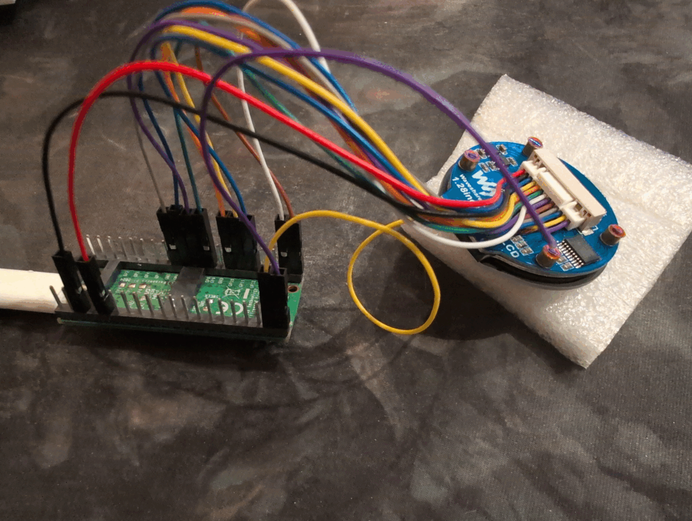
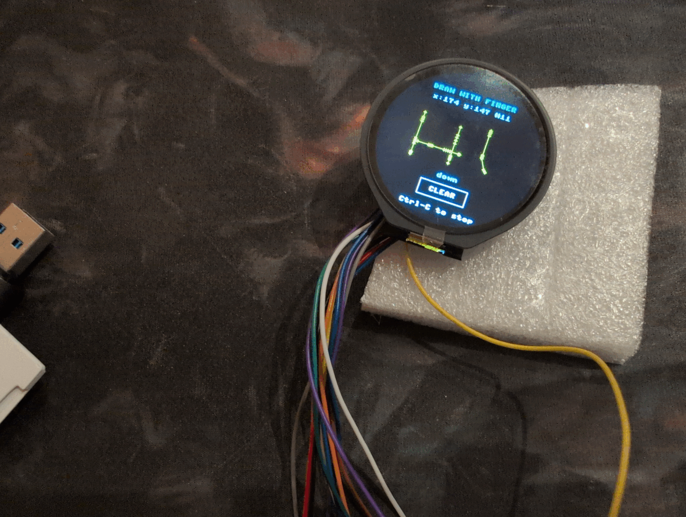

## Pictures

## Product Information and Pins

* Product: https://www.waveshare.com/1.28inch-touch-lcd.htm

* display size: 1.28 inches, Φ32.4mm
* module size: 39.89 × 38.50mm Φ38.50mm
* pixel size: 0.135 × 0.135 mm
* resolution: 240x240
* display color: 65k colors
* panel: IPS
* display driver: GC9A01
* capacitive touch driver: CST816S
* touch interface: I2C
* interface: SPI (4-wire)
* supports controller boards like Raspberry Pi/Raspberry Pi Pico/Arduino/STM32
* Comes with online development resources and manual (examples for Raspberry Pi/Raspberry Pi Pico/Arduino/STM32)
* operating voltage: 3.3v / 5v
* [module schematic](https://files.waveshare.com/upload/c/c8/1.28inch_Touch_LCD_Schematic.pdf) and [Waveshare's Pico example](https://files.waveshare.com/upload/3/3e/1.28inch_Touch_LCD_Pico.zip)

* there are 13 wires coming from the included display connector:
    * VCC       [Power (3.3V / 5V input)]
    * GND       [Ground]
    * MISO      [SPI MISO pin]
    * MOSI      [SPI MOSI pin]
    * SCLK      [SPI Clock pin]
    * LCD_CS    [LCD Chip Selection, low active]
    * LCD_DC    [LCD Data/Command selection (high for data, low for command)]
    * LCD_RST   [LCD Reset, low active]
    * LCD_BL    [LCD Backlight]
    * TP_SDA    [TP Data pin]
    * TP_SCL    [TP Clock pin]
    * TP_INT    [TP Interrupt pin]
    * TP_RST    [TP Reset, low active]

## Connection to Pico 2 W pins (Display Pin -> Pico Pin)

Use the following connections, matching [Waveshare's Pico wiring and examples](https://www.waveshare.com/wiki/1.28inch_Touch_LCD). The Pico 2 W has the same header assignments for these pins, checked against the local [Pico 2 W datasheet](../../../0%20MCU/RPI/pico-2-w-datasheet.pdf), Figure 2 and sections 2.1 and 3.2.

| Display wire | Pico 2 W pin name | Physical header pin | Purpose |
| --- | --- | --- | --- |
| VCC | 3V3(OUT) | 36 | 3.3 V power for the display module |
| GND | GND | 13 | Common ground; any Pico GND pin also works |
| MISO | GP12 | 16 | SPI1 RX: data from display to Pico |
| MOSI | GP11 | 15 | SPI1 TX: data from Pico to display |
| SCLK | GP10 | 14 | SPI1 clock |
| LCD_CS | GP9 | 12 | LCD chip select; output, active low |
| LCD_DC | GP14 | 19 | LCD data/command; output, high = data, low = command |
| LCD_RST | GP8 | 11 | LCD reset; output, active low |
| LCD_BL | GP15 | 20 | Backlight control; output, high = on; PWM for brightness |
| TP_SDA | GP6 | 9 | I2C1 data for touch controller |
| TP_SCL | GP7 | 10 | I2C1 clock for touch controller |
| TP_INT | GP17 | 22 | Touch interrupt; input |
| TP_RST | GP16 | 21 | Touch controller reset; output, active low |

## MicroPython driver and test demo

* [touch_lcd.py](touch_lcd.py): standalone GC9A01 display and CST816S/T touch driver, using only modules included in standard Pico 2 W MicroPython firmware. It includes the LCD initialization, RGB565 framebuffer, drawing/text helpers, backlight PWM, touch coordinates and gesture codes. Its default pins match the wiring table above.
* [demo_touch_lcd.py](demo_touch_lcd.py): color, gradient, geometry, animation and brightness tests, followed by touch orientation setup, five touch targets and a drawing pad with a CLEAR button. No separate fonts, images or packages are required on the Pico.
