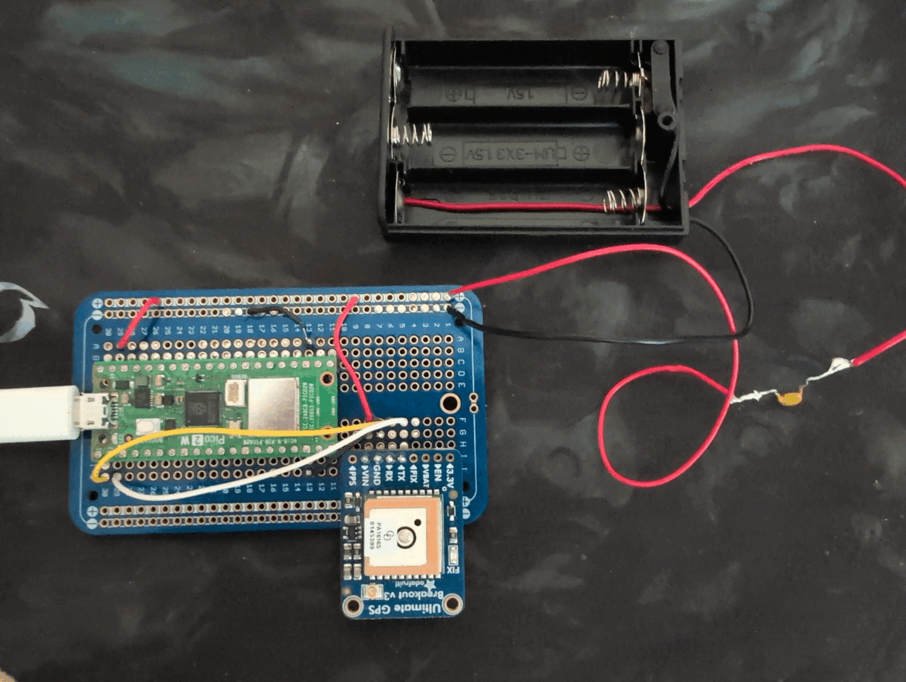

# Portable GPS logger



This is a battery-powered logger that records one valid GPS position every two
seconds. Stores the log persistently in the Pico 2 W's onboard flash so that 
it survives normal shutdowns and unexpected loss of main power.
No SD card or network connection is required.

The GPS breakout's CR1220 coin cell is only a backup for its real-time clock
and satellite data. It does **not** power the GPS receiver. The 3x AA battery pack powers
both the Pico and GPS while logging.

## Safety Notice

Remove all batteries from the battery pack before connecting the pico via USB!
The CR1220 coincell of the GPS module can stay connected of all times and is expected to last at least 240 days,
longer if you actively power the board with the battery pack often. It keeps the GPS real-time clock, retained satellite data, and receiver
configuration alive, which usually gives a faster warm start after the logger
is switched back on.

Before first power-up, use continuity mode to check that the positive and
negative rails are not shorted. Then verify that battery `+` reaches GPS `VIN`
and Pico `VSYS`, battery `-` reaches both ground pins, and battery `+` does not
reach Pico `3V3(OUT)`.

## Parts

* Raspberry Pi Pico 2 W
* [Adafruit Ultimate GPS Breakout - 66 Channels with 10 Hz updates, Version 3](https://www.berrybase.de/adafruit-ultimate-gps-breakout-66-kanaele-mit-10-hz-updates)
* CR1220 coin cell for the GPS backup holder
* 3xAA battery holder
* Three AA NiMH or alkaline cells
* Bourns MF-R025 250 mA resettable fuse (PPTC/polyfuse)

Three AA cells are suitable because both the Pico `VSYS` input and GPS `VIN`
accept the pack's voltage.

## Wiring

### Power: where the battery positive goes

In this build, the GPS breakout receives the **switched battery voltage at its
`VIN` pin**, not power from the Pico's `3V3(OUT)` pin. The battery supply is
connected to the Pico `VSYS` input and the GPS `VIN` input in parallel:

```text
3xAA switched holder red (+)
        |
        +---- MF-R025 fuse ---- positive (+) rail
                                      |       |
                                      |       +---- GPS VIN
                                      +------------ Pico VSYS (physical pin 39)

3xAA holder black (-) ------ negative (-) rail
                                      |       |
                                      |       +---- GPS GND
                                      +------------ Pico GND (physical pin 38)
```

The diagram assumes the switch is built into the battery holder. Put the
MF-R025 in series with the red battery wire, as close to the holder as
practical. The red wire must reach the positive rail only through the fuse; the
holder's switch disconnects it from the cells.

This does not mean that the sensitive GPS electronics run directly at the
varying battery voltage. There are two separate regulators, one on each board:

```text
                                     +---- Pico VSYS ---- Pico's regulator ---- 3.3 V for Pico
battery pack ---- fuse ---- + rail --+
                                     +---- GPS VIN ----- GPS's regulator ----- regulated GPS power
```

This arrangement lets the GPS breakout's onboard low-dropout regulator produce 
its own clean supply directly from the relatively quiet battery source, 
instead of first passing the power through the Pico's switching regulator. 
Adafruit designed GPS `VIN` to accept 3-5 V for this reason. The three-cell pack is appropriate for these two inputs: 
Pico `VSYS` accepts 2-5 V and GPS `VIN` accepts 3-5 V. The GPS breakout 
regulates its `VIN` internally.

Connect GPS `VIN` to the positive battery rail and leave Pico `3V3(OUT)` disconnected.


### Using the breadboard power rails

1. Connect the fused and switched red battery-holder wire to the rail marked
   `+`.
2. Run one jumper from that same `+` rail to Pico `VSYS` (physical pin 39).
3. Run a second jumper from that same `+` rail to GPS `VIN`.
4. Connect the black battery-holder wire to the rail marked `-`.
5. Run one jumper from that same `-` rail to Pico `GND` (physical pin 38).
6. Run a second jumper from that same `-` rail to GPS `GND`.

### UART signal wires

| From | To |
| --- | --- |
| Pico `GP0` / UART0 TX, physical pin 1 | GPS `RX` |
| Pico `GP1` / UART0 RX, physical pin 2 | GPS `TX` |

The MF-R025 has a 250 mA hold current and approximately 500 mA trip current,
which is appropriate for this logger. It protects the wiring and battery from
sustained overcurrent or a short circuit. It is a slow, resettable fuse rather
than an exact 250 mA cutoff. The higher-rated MF-R050 and MF-R110 provide less
useful protection for this small load.

Install the CR1220 in the GPS breakout's coin-cell holder. Leave `EN`, `FIX`,
and `PPS` disconnected; they are not needed for the minimal logger.

## Flash capacity

The Pico 2 W has 4 MB of onboard flash shared by the firmware, program, and
data filesystem. Three hours at one row every two seconds produces 5,400 rows.
At roughly 60-100 bytes per row, the log uses approximately 0.3-0.55 MB, so it
fits comfortably alongside MicroPython and the logger program.

Do not store all raw NMEA sentences or verbose debug output. The firmware
should check free space before starting and stop cleanly instead of overwriting
an existing log if storage becomes full.

You can expect almost 24 hours of GPS data storage, assuming you do not change
the interval at which GPS data is retrieved.

## Retrieving a log

1. Switch off the AA battery pack and remove all batteries from it.
2. Connect the Pico to a computer over USB **without** holding `BOOTSEL`.
3. Run `download_gps.sh` and it will create a csv file with logged data and an overview of each logging session and how much storage your pico has left.

## Clearing the pico storage

If the sh script shows that you will soon not have enough storage left, you should run `force_delete_pico_storage.sh`.
This is a destructive action that can lead to data loss if you previously have not backed up the GPS data collected so far with the `download_gps.sh` script.
After running the deletion script your pico won't be logging GPS data until you reconnect USB or battery power.

### Log Data

* Each log entry has:
    * utc timestamp
    * latitude
    * longitude
    * altitude_m (altitude in meters)
    * speed_knots (e.g. 0.2), but our sh export script converts this to altitude_kmh (so we have human-readable km/h)
    * satellites (e.g. 5)
    * hdop ('Horizontal Dilution of Precision', basically describes data quality and here lower is better: <1 is excellent, 1-2 is good, 2-5 is moderate, 5-10 is poor, >10 is unreliable)

## Resources

- [Adafruit Ultimate GPS guide](https://learn.adafruit.com/adafruit-ultimate-gps)
- [Adafruit GPS pinouts](https://learn.adafruit.com/adafruit-ultimate-gps/pinouts)
- [MicroPython persistent filesystem documentation](https://docs.micropython.org/en/latest/reference/filesystem.html)
- [Raspberry Pi Pico 2 documentation](https://www.raspberrypi.com/documentation/microcontrollers/pico-series.html)
- [Bourns MF-R resettable-fuse datasheet](https://www.bourns.com/docs/product-datasheets/mf-r.pdf)
